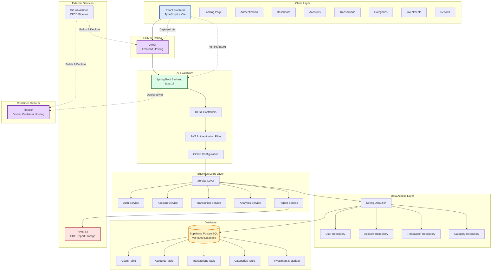
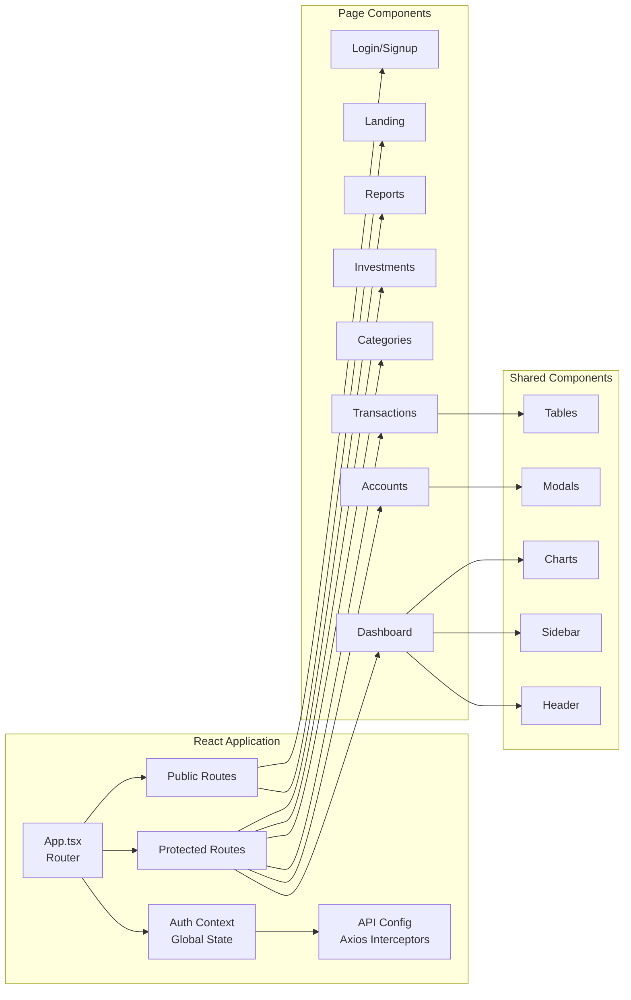
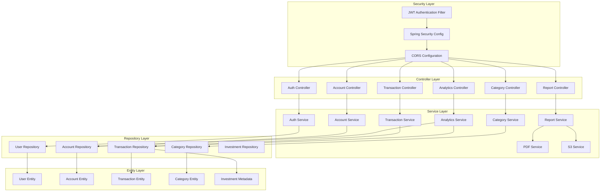
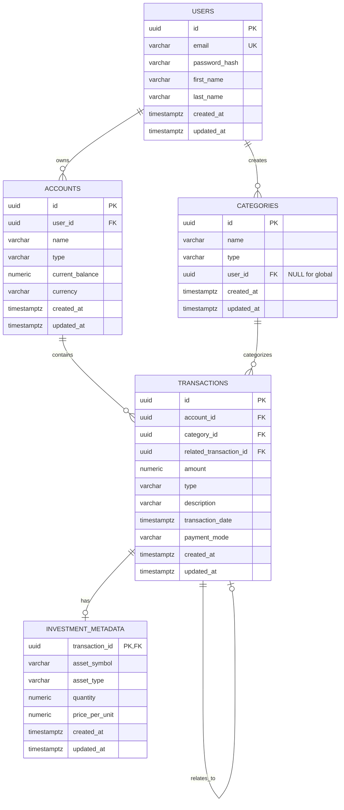
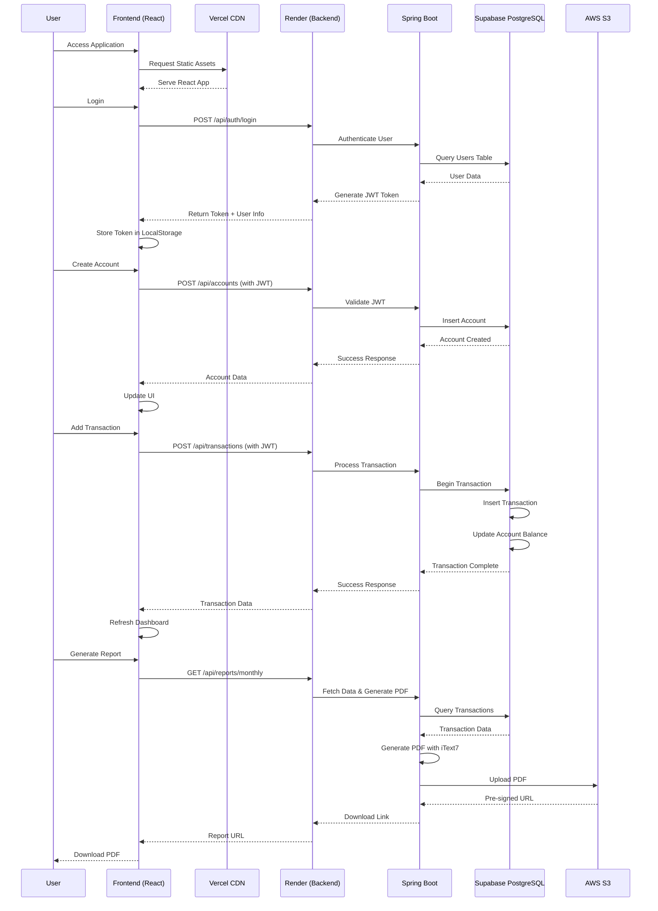
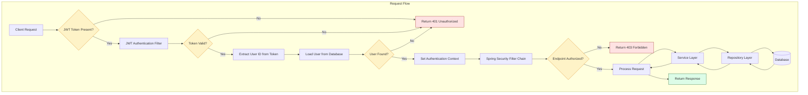
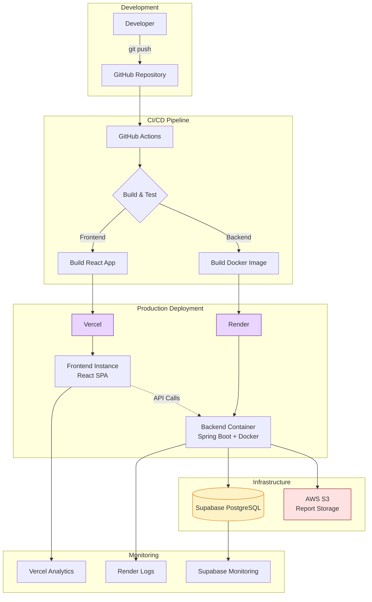

# Finaltica - Smart Expense and Investment Management System

Finaltica is a professional-grade, N-tier personal finance application designed to centralize the management of liquid cash, credit liabilities, and long-term investments. By implementing a sophisticated digital ledger system, the platform bridges the gap between simple manual tracking and professional wealth management, providing users with a comprehensive view of their net worth.

## Architecture Overview



## System Architecture Details

### Frontend Architecture


### Backend Architecture


### Database Schema


## Features

### User Authentication and Security
- Secure registration and login using Spring Security.
- Stateless authentication powered by JSON Web Tokens (JWT).
- Role-based access control to ensure data isolation and privacy.

### Multipurpose Account Management
- Support for multiple virtual account types including Checking, Savings, and Credit Cards.
- Distinct logic for credit vs. debit: credit transactions increase liabilities while debit transactions decrease assets.
- Real-time balance synchronization across all linked accounts.

### Transaction Engine
- Detailed logging for three primary categories: Income, Expenses, and Investments.
- Automated updates to account balances upon transaction confirmation.
- Categorization and metadata tagging (Source, Method, Merchant, and Mode) for advanced filtering.

### Investment and Wealth Tracking
- Asset management for stocks, mutual funds, and fixed deposits.
- ROI (Return on Investment) calculation logic based on purchase price vs. current market value.
- Portfolio visualization to track long-term growth and asset allocation.

### Intelligence and Reporting
- Automated generation of monthly financial health reports in PDF format.
- Rule-based advisory engine that analyzes spending patterns to offer budget optimizations.
- Cloud-based storage for historical report retrieval.

## Tech Stack

### Frontend
- **React 18 with TypeScript**: Type-safe, component-based UI architecture
- **Vite**: Fast build tool and development server
- **React Router v6**: Client-side routing and navigation
- **Recharts**: Interactive financial data visualization
- **Axios**: HTTP client with request/response interceptors
- **Lucide React**: Modern icon library
- **CSS Modules**: Scoped styling with design system

### Backend
- **Java 17 & Spring Boot 4.0.1**: The core framework for handling business logic and RESTful API services.
- **Spring Security**: To manage authentication and JWT-based authorization.
- **Spring Data JPA**: For streamlined database interaction and ORM mapping.
- **Hibernate 7.2**: Advanced ORM with PostgreSQL dialect support
- **JWT (jjwt 0.12.5)**: Secure token-based authentication
- **iText7**: PDF generation for financial reports
- **AWS SDK**: S3 integration for report storage
- **Lombok**: Reduced boilerplate code

### Data and Storage
- **PostgreSQL 13**: A relational database ensuring ACID compliance for financial integrity.
- **AWS S3**: For scalable storage of generated PDF financial statements.
- **Supabase**: Utilized as a managed Backend-as-a-Service (BaaS) platform to provide the primary PostgreSQL instance, real-time database subscriptions for live dashboard updates, and integrated authentication metadata.

### Deployment and Infrastructure
- **Vercel**: Hosting platform for the React frontend with automatic deployments.
- **Render**: Docker-based hosting for the Spring Boot backend service.
- **GitHub Actions**: For CI/CD automation and deployment pipelines.
- **Docker**: Containerized backend for consistent deployment environments.

## Data Flow



## Security Architecture



## Deployment Architecture



## Features

### User Authentication and Security
- Secure registration and login using Spring Security.
- Stateless authentication powered by JSON Web Tokens (JWT).
- Role-based access control to ensure data isolation and privacy.

### Multipurpose Account Management
- Support for multiple virtual account types including Checking, Savings, and Credit Cards.
- Distinct logic for credit vs. debit: credit transactions increase liabilities while debit transactions decrease assets.
- Real-time balance synchronization across all linked accounts.

### Transaction Engine
- Detailed logging for three primary categories: Income, Expenses, and Investments.
- Automated updates to account balances upon transaction confirmation.
- Categorization and metadata tagging (Source, Method, Merchant, and Mode) for advanced filtering.

### Investment and Wealth Tracking
- Asset management for stocks, mutual funds, and fixed deposits.
- ROI (Return on Investment) calculation logic based on purchase price vs. current market value.
- Portfolio visualization to track long-term growth and asset allocation.

### Intelligence and Reporting
- Automated generation of monthly financial health reports in PDF format.
- Rule-based advisory engine that analyzes spending patterns to offer budget optimizations.
- Cloud-based storage for historical report retrieval.

## Tech Stack

### Frontend
- **React 18 with TypeScript**: Type-safe, component-based UI architecture
- **Vite**: Fast build tool and development server
- **React Router v6**: Client-side routing and navigation
- **Recharts**: Interactive financial data visualization
- **Axios**: HTTP client with request/response interceptors
- **Lucide React**: Modern icon library
- **CSS Modules**: Scoped styling with design system

### Backend
- **Java 17 & Spring Boot 4.0.1**: The core framework for handling business logic and RESTful API services.
- **Spring Security**: To manage authentication and JWT-based authorization.
- **Spring Data JPA**: For streamlined database interaction and ORM mapping.
- **Hibernate 7.2**: Advanced ORM with PostgreSQL dialect support
- **JWT (jjwt 0.12.5)**: Secure token-based authentication
- **iText7**: PDF generation for financial reports
- **AWS SDK**: S3 integration for report storage
- **Lombok**: Reduced boilerplate code

### Data and Storage
- **PostgreSQL 13**: A relational database ensuring ACID compliance for financial integrity.
- **AWS S3**: For scalable storage of generated PDF financial statements.
- **Supabase**: Utilized as a managed Backend-as-a-Service (BaaS) platform to provide the primary PostgreSQL instance, real-time database subscriptions for live dashboard updates, and integrated authentication metadata.

### Deployment and Infrastructure
- **Vercel**: Hosting platform for the React frontend with automatic deployments.
- **Render**: Docker-based hosting for the Spring Boot backend service.
- **GitHub Actions**: For CI/CD automation and deployment pipelines.
- **Docker**: Containerized backend for consistent deployment environments.

## API Endpoints

### Authentication
- `POST /api/auth/signup` - User registration
- `POST /api/auth/login` - User authentication

### Accounts
- `GET /api/accounts` - Get all user accounts
- `GET /api/accounts?type={type}` - Filter accounts by type
- `GET /api/accounts/{id}` - Get specific account
- `POST /api/accounts` - Create new account
- `PUT /api/accounts/{id}` - Update account
- `DELETE /api/accounts/{id}` - Delete account

### Transactions
- `GET /api/transactions` - Get all transactions
- `GET /api/transactions?accountId={id}` - Filter by account
- `GET /api/transactions?categoryId={id}` - Filter by category
- `GET /api/transactions?type={type}` - Filter by type
- `GET /api/transactions?startDate={date}&endDate={date}` - Filter by date range
- `POST /api/transactions` - Create transaction
- `POST /api/transactions/transfer` - Create transfer
- `POST /api/transactions/investment` - Create investment
- `DELETE /api/transactions/{id}` - Delete transaction

### Categories
- `GET /api/categories` - Get all categories (global + user)
- `GET /api/categories?type={type}` - Filter by type
- `POST /api/categories` - Create custom category
- `PUT /api/categories/{id}` - Update category
- `DELETE /api/categories/{id}` - Delete category

### Analytics
- `GET /api/analytics/networth` - Calculate net worth
- `GET /api/analytics/monthly-summary?year={year}&month={month}` - Monthly summary
- `GET /api/analytics/category-spending?startDate={date}&endDate={date}` - Category breakdown

### Reports
- `GET /api/reports/monthly?year={year}&month={month}` - Generate monthly PDF
- `GET /api/reports/custom?startDate={date}&endDate={date}` - Generate custom PDF

## Getting Started

### Prerequisites
- Node.js 18+
- Java 17+
- Maven 3.9+
- Docker (optional)
- PostgreSQL 13+ (or Supabase account)
- AWS Account (for S3)

### Frontend Setup

```bash
cd frontend

# Install dependencies
npm install

# Create .env file
cat > .env << EOF
VITE_API_BASE_URL=https://your-backend-url.com
EOF

# Run development server
npm run dev

# Build for production
npm run build
```

### Backend Setup

```bash
cd backend

# Create .env file with database credentials
cat > .env << EOF
DB_URL=jdbc:postgresql://your-supabase-url/postgres
DB_USERNAME=postgres
DB_PASSWORD=your-password
JWT_SECRET=your-secret-key-at-least-256-bits
AWS_ACCESS_KEY_ID=your-key
AWS_SECRET_ACCESS_KEY=your-secret
AWS_S3_BUCKET_NAME=your-bucket
AWS_REGION=us-east-1
SERVER_PORT=8080
EOF

# Run with Maven
./mvnw spring-boot:run

# Or build Docker image
docker build -t finaltica-backend .
docker run -p 8080:8080 finaltica-backend
```

## Project Structure

```
finaltica/
├── frontend/
│   ├── src/
│   │   ├── components/      # Reusable UI components
│   │   ├── pages/           # Page components
│   │   ├── context/         # React context (auth)
│   │   ├── config/          # API configuration
│   │   ├── utils/           # Utility functions
│   │   ├── typings/         # TypeScript types
│   │   ├── styles/          # CSS modules
│   │   ├── App.tsx
│   │   └── main.tsx
│   ├── public/
│   ├── package.json
│   ├── vite.config.ts
│   └── tsconfig.json
│
└── backend/
    ├── src/
    │   ├── main/
    │   │   ├── java/com/finaltica/application/
    │   │   │   ├── config/          # Security, CORS, AWS
    │   │   │   ├── controller/      # REST endpoints
    │   │   │   ├── service/         # Business logic
    │   │   │   ├── repository/      # Data access
    │   │   │   ├── entity/          # JPA entities
    │   │   │   ├── dto/             # Data transfer objects
    │   │   │   ├── enums/           # Enumerations
    │   │   │   ├── filter/          # JWT filter
    │   │   │   ├── util/            # Utilities
    │   │   │   └── Application.java
    │   │   └── resources/
    │   │       └── application.properties
    │   └── test/
    ├── Dockerfile
    └── pom.xml
```

## Contributing

1. Fork the repository
2. Create your feature branch (`git checkout -b feature/AmazingFeature`)
3. Commit your changes (`git commit -m 'Add some AmazingFeature'`)
4. Push to the branch (`git push origin feature/AmazingFeature`)
5. Open a Pull Request

## License

This project is licensed under the MIT License.

## Authors

- **Adharsh Rengarajan** - Initial work

## Acknowledgments

- Spring Boot documentation
- React and Recharts communities
- Supabase and Render teams for excellent developer platforms
