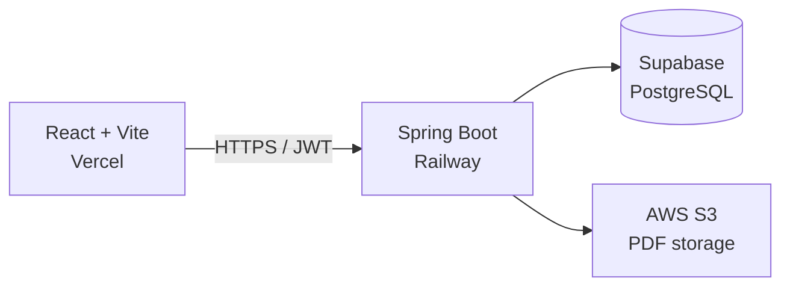
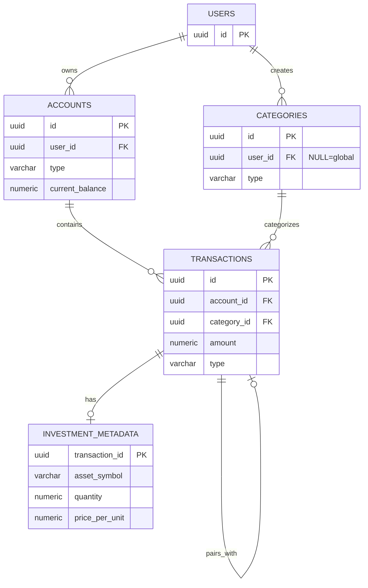

# Finaltica

A personal finance application that unifies cash, credit, and investment tracking into a single net-worth view. Built as a full-stack TypeScript + Spring Boot system with PostgreSQL and AWS S3.

Live: [finaltica.vercel.app](https://finaltica.vercel.app)

## What it does

- **Accounts** — checking, credit, cash, and investment accounts, each with type-aware balance rules (credit cards can go negative, others can't).
- **Transactions** — income, expense, and transfers between accounts. Balance updates are atomic and validated against insufficient funds.
- **Investments** — stock and mutual fund holdings with weighted-average cost basis and per-symbol returns.
- **Analytics** — net worth, monthly cash flow, category spending, and portfolio summary.
- **Reports** — monthly and custom-range PDFs, stored in S3 with pre-signed download URLs.

## Architecture


```mermaid
graph LR
    A[React + Vite<br/>Vercel] -->|HTTPS / JWT| B[Spring Boot<br/>Railway]
    B --> C[(Supabase<br/>PostgreSQL)]
    B --> D[AWS S3<br/>PDF storage]
```

Three-tier setup: React SPA on Vercel talks to a Spring Boot API on Railway (Docker), which reads/writes Supabase PostgreSQL and stores generated PDFs in S3.

### Data model


```mermaid
erDiagram
    USERS ||--o{ ACCOUNTS : owns
    USERS ||--o{ CATEGORIES : creates
    ACCOUNTS ||--o{ TRANSACTIONS : contains
    CATEGORIES ||--o{ TRANSACTIONS : categorizes
    TRANSACTIONS ||--o| INVESTMENT_METADATA : has
    TRANSACTIONS ||--o| TRANSACTIONS : pairs_with

    USERS { uuid id PK }
    ACCOUNTS { uuid id PK uuid user_id FK varchar type numeric current_balance }
    CATEGORIES { uuid id PK uuid user_id FK "NULL=global" varchar type }
    TRANSACTIONS { uuid id PK uuid account_id FK uuid category_id FK numeric amount varchar type }
    INVESTMENT_METADATA { uuid transaction_id PK varchar asset_symbol numeric quantity numeric price_per_unit }
```

Transfers are modeled as two paired transactions (debit + credit) linked via `related_transaction_id`, so the ledger always balances.

## Tech stack

| Layer | Stack |
|---|---|
| Frontend | React 18, TypeScript, Vite, React Router, Recharts, Axios, Lucide |
| Backend | Java 17, Spring Boot 4, Spring Security, JPA/Hibernate, JWT, iText7 |
| Data | Supabase (PostgreSQL 17), AWS S3 |
| Deploy | Vercel (frontend), Railway (Docker container), GitHub Actions |

## API surface

Auth (public): `POST /api/auth/{signup,login}`

Resources (JWT required):
- `/api/accounts` — CRUD, filterable by type
- `/api/transactions` — CRUD plus `/transfer` and `/investment` endpoints; filter by account, category, type, date range
- `/api/transactions/investments` — joined view with metadata
- `/api/categories` — global + user-scoped
- `/api/analytics/{networth,monthly-summary,category-spending,portfolio}`
- `/api/reports/{monthly,custom}` — returns pre-signed S3 URLs

## Security model

- Stateless JWT auth, BCrypt password hashing
- Optimistic locking on `Account` to prevent concurrent balance corruption
- Per-IP rate limit on `/api/auth/*` (10 req/min)
- Validation chain: Jakarta annotations → service-layer business rules → DB constraints
- Every cross-resource query checks ownership before returning data

## Running locally

**Backend** (`backend/`):

```bash
cp .env.example .env   # fill in DB, JWT_SECRET, AWS keys
./mvnw spring-boot:run
```

**Frontend** (`frontend/`):

```bash
echo "VITE_API_BASE_URL=http://localhost:8080" > .env
npm install
npm run dev
```

Both run on `localhost:8080` and `localhost:3000` by default.

## Project layout

```
finaltica/
├── backend/   Spring Boot (controller → service → repository → entity)
└── frontend/  React + Vite (pages, components, context, typings)
```

## Author

Adharsh Rengarajan
